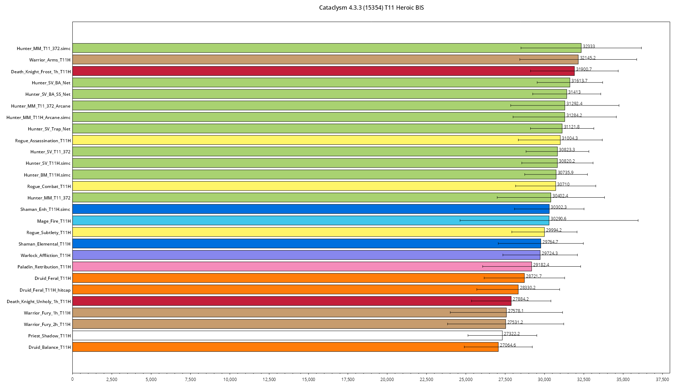

# Classic Cataclysm Simulationcraft Rankings

I made a simple project to take the latest version (that I could find) of Simcraft for Cataclysm, and apply them to the T11 BIS sims.
Should be the closest approximation we can get pre-beta.

Everything is simmed on SimulationCraft 433-2
for World of Warcraft 4.3.3 Live (build level 15354)

## Simulation Results




## Contributing
If you want to modify the sim for your class, please make a PR with the changes. Or adding one.

## Requirements
* Bring your own version of Simcraft
* You need an appsettings.json with the following format:
```json
{
  "SimcraftOptions": {
    "SimcPath": "",
    "InputPath": "",
    "OutputPath": ""
  }